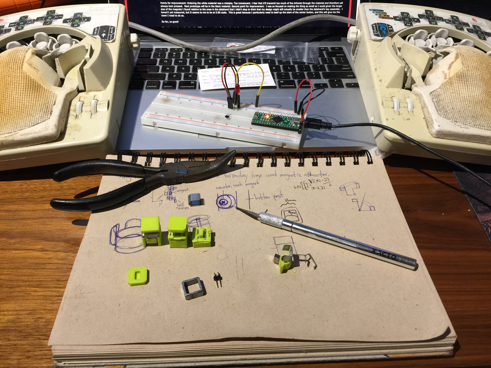

# ⌨️ My Keyboard
> 2015/09/05 - Beginning the dream of replicating my datahand keyboard

> 2018/10/06 - I've picked this project back up and am working on new designs

I use a [Datahand keyboard](https://en.wikipedia.org/wiki/DataHand).
It's the best thing that's happened to my fingers and wrists since\...
It's the best thing that has ever happened to my fingers and wrists.
I see a lot of parallels between the Datahand and pure functional programming
(lol).  They both take lots of commitment. They change the entire way you think
about their domain, but what they offer in return is a big improvement in
experience and productivity. I have found that I really love programming in
Haskell, and I really love typing on my Datahand. The combination is
[like a drug](https://web.archive.org/web/20150907153510/http://virtuecenter.com/blog/the_effects_of_computer_programming_on_the_brain.html).

Unfortunately the company that produces the Datahand went out of business years
ago due to shady dealings and mismanagement. I got the inside scoop from one of
Datahand's ex-excutives, but that's a different story all together. I realized
that if anything were to happen to even one key on my keyboard I'd be up poop
creek trying to find a replacement. No other keyboard comes close to the
Datahand with the effortless, clicky waves my hands perform in order to make
characters appear on the screen. I have a
[Happy Hacking Pro 2](https://en.wikipedia.org/wiki/Happy_Hacking_Keyboard)
(which I keep close to my heart) and previously a blank
[Das Keyboard](https://en.wikipedia.org/wiki/Das_Keyboard).
Neither keyboard comes close.  I would have procured a
[Kinesis Advantage](https://en.wikipedia.org/wiki/Kinesis_(keyboard))
if I hadn't had an oppurtunity to skip that level entirely and warp straight to
the Datahand. I'd love to hear about the comparison between the two from someone
who owns both but the Datahand is becoming exceedingly rare, making that
situation rather uncommon.

Something has to be done - the alternate future that never was (in which
er'body typing well) must live again. Now is the time. The 90's are back and
people are finally ready to revisit odd looking hardware (as well as clunky
boots, trench coats, dreadlocks and AI).

[Some other folks agree with me](https://geekhack.org/index.php?topic=41422.0)
and have made some really great strides toward recreating the Datahand. I'd
love to get in a group buy of that project if it ever comes to fruition. In the
meantime I've bought a 3d printer and started designing my own take on the old
Datahand with a few twists. I can't wait to show you. Here's a picture of my
desktop real quick:

Pictured here are three prototype magnetic switches, some refuse, tools,
[a teensy++](http://pjrc.com/store/teensypp.html)
(my board of choice) and a small circuit involving a unipolar hall effect
switch.

This is going to be a very fun project.

> [Comments on Hacker News](https://news.ycombinator.com/item?id=10176976)
