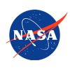
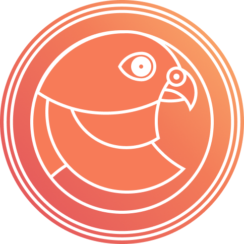

# Schell Carl Scivally

📞 <small>+64 021 420 471</small>
<small>efsubenovex at gmail dot com</small>

I'm passionate about functional programming, real time graphics and sound synthesis.
In my free time I like to build things and play games with my kids.
In the past I've made music with my friends and played shows, toured the US with a band, drove forklifts in a chemical plant and bailed hay in three states.

This resume lives permanently at [https://zyghost.com/resume.html](https://zyghost.com/resume.html).

### 🏠 Current Location

I am a US citizen splitting my life between South Pasadena, California 🐻🇺🇸, and Nelson, New Zealand 🌴🇳🇿.

### 🔗 Links

- [GitHub - https://github.com/schell](https://github.com/schell)
- [LinkedIn - https://linkedin.com/in/schellscivally](https://linkedin.com/in/schellscivally)

## Open Source Work

- I'm a [maintainer of Rust-GPU](https://rust-gpu.github.io/blog/2024/11/06/new-maintainers), which is a Rust compiler that generates SPIR-V shaders.
- I [added support for atomic operations to `wgpu`'s transpiler SPIR-V frontend](https://github.com/gfx-rs/wgpu/issues/4489).
- I am an [NLNet grantee, working on a cross-platform GPU-driven renderer that runs on WebGPU](https://nlnet.nl/project/Renderling/).
- Authored [renderling](https://github.com/schell/renderling), a 3d physically-based renderer with easy resource management.
- Authored [crabslab](https://github.com/schell/crabslab), a slab allocator for working with GPUs in Rust.
- I contributed [RenderLayers to the popular Bevy game engine](https://github.com/bevyengine/bevy/pull/1209).
- I authored [typograffiti](https://github.com/schell/typograffiti/), a text renderer written in Haskell. 
  * I am the initial author but have since moved on to `renderling`. 
  * I handed off maintainership of `typograffiti` to Adrian Cochrane (**alcinnz** on github) who himself is a NLNet grantee.

## Day Job Experience

###  Narrative.so <time class="resume-date">Feb 2021 - Present</time>
#### Senior Rust Software Engineer

Reduced the time to deliver new AI models from R&D to production by 50%.

Integrated batch processing of ONNX models into AI inference systems in Rust.

Optimized a cross-platform consumer application that performs AI inference on the edge, including

* performance profiling and optimization
* shipping new AI models and features
* refactored build systems to use Rust `xtask`

Authored a realtime image editing application in Rust using `wgpu`, `WGSL` and `WASM`.

Rust, Python, Lua, C, C++, JavaScript, Typescript

###  Formation.ai <time>Oct 2016 - Feb 2021 (4 years 5 months)</time>
#### Senior Software Engineer

Full stack engineering in Haskell using `reflex`. Rust, Go, AWS.

* single-handedly authored, deployed, and maintained a cloud-based template language interpreter in
Rust that ran 24 million+ Starbucks req/day for 6 months - bug free!
* built a fullstack application in Haskell to author Starbucks' Star Program offers.

Formation.ai was acquired by BCG and was formerly Takt.com.

Haskell, Javascript, Rust

###  Syndeca.com <time>Apr 2010 - Oct 2016 (6 years 7 months)</time>
#### Senior Developer

Full stack engineering in Objective-C, Flash, Javascript and Haskell.

* single-handedly authored, deployed and maintained SDK and applications for clients
including:
  - Nordstrom
  - Home Depot
  - Lowes
  - Bass Pro
  - Sears
* internal productivity tools in Haskell

Objective-C, JavaScript, Haskell 

### 🤝 Freelancing <time>2005 - 2012</time>

Flash game development, interactive displays, website design and implementation.

Clients include:

- Viddyou.com <time>2009</time> (acquired by Motionbox in 2013)
  * authored Viddyou's HD streaming video player
- Opsworks, Inc.
  * authored the Larchmont Charter School auction and payment system
- Synapse Group, Inc. (digital agency)
  * completed many projects for Fortune-500 clients like:
    - IBM
    - 3M
    - Sears
    - Lowes
    - Nordstrom
- Sonoma State University

###  NASA Education and Public Outreach <time>Sep 2003 - Apr 2008 (4 years 9 months)</time>

Flash game development.

* Designed and authored the "Solar Supernova" Space Mysteries game
* Authored, deployed and maintained many of the program's various websites

## 🎞️ Honors and Awards

###  Cultural Award - We’re Daring
**Narrative.so** <time>Feb 2025</time>

For excellent work planning and orchestrating the delivery of new AI models into production.

> We act decisively to make brave and bold choices.

###  Cultural Award - Embrace Creative Freedom
**Narrative.so** <time>Nov 2023</time>

For shipping consistenly and quickly, with an eye for creative solutions.

> We walk in artists’ shoes and embrace creative freedom. We’re curious, passionate and hunt for the deeper meaning.

###  Cultural Award - Seek Truth
**Narrative.so** <time>Aug 2021</time>

For work on integrating TVM tuning into AI model pipelines and revamping build systems.

> We seek out our strengths and weaknesses and accept them – at all times being authentically true to ourselves, and each other.

### Mcquillen Summer Research Award
**Sonoma State University** <time>Jun 2005</time>

Selected to refurbish a thin film sputter coating machine and work on various high vacuum projects in the physics department.
